# Onepage Report: champion_v5_20251231

**생성일**: 2025-12-31 04:56:19

---

## 1. 핵심 성능 요약

| 지표 | 값 |
|---|---|
| **Tuning Mean** | 1.7618 |
| **Tuning Min** | 0.0508 |
| **Lockbox Mean** | 1.7927 |
| **Lockbox Min** | 1.3469 |
| **Fold14 MDD (2020)** | 0.00% |
| **Worst MDD** | 0.00% |
| **Positive Folds** | 20/20 |
| **OOS/IS Ratio** | 1.2443 |

---

## 2. 아키텍처 (Full Version)

```mermaid
flowchart LR
  %% ===== Data Plane =====
  subgraph DP[DATA PLANE]
    MKT[시장데이터<br/>가격/거래량/지수] --> ING[Ingestion]
    MACRO[(매크로<br/>VIX/금리/스프레드)] --> ING
    FUND[(펀더멘털/실적<br/>PEAD)] --> ING
    ALT[(대체데이터<br/>뉴스/심리)] --> ING
    ING --> DQ[Data Quality Gate]
    DQ --> DB[(DB/Feature Store)]
  end

  %% ===== Feature Layer =====
  subgraph FL[FEATURES]
    DB --> FB[Feature Builder]
    FB --> FEATS[(Feature Set)]
    FEATS --> VIXF[VIX State]
    FEATS --> REGF[Regime Inputs]
    FEATS --> RSF[RateShock Features<br/>d2y_5d_bp,d2y_20d_bp]
    FEATS --> MGF[MacroGate Features]
  end

  %% ===== Alpha / Portfolio =====
  subgraph AP[ALPHA / PORTFOLIO]
    FEATS --> AO[Alpha Orchestrator]
    AO --> SIG[Signals]
    SIG --> ICIR4[ICIR v4]
    ICIR4 --> W0[Base Weights]
    W0 --> OPTI{Optimizer}
    OPTI --> MVO[MVO]
    OPTI --> HEU[Heuristic/RP]
    MVO --> W1[Weights]
    HEU --> W1
  end

  %% ===== Risk/Overlay =====
  subgraph RL[RISK / OVERLAYS]
    W1 --> REG15[regime15]
    W1 --> VIXSZ[vix_sizing]
    W1 --> MACG[macro_gate]
    W1 --> RSG[rate_shock_gate]
    W1 --> CB[cb]
    W1 --> THR[throttle]
    W1 --> COMPAT[compat]
    W1 --> NOTRADE[no_trade]

    REG15 --> BAND[Band Mult / State]
    VIXSZ --> SCALE[Scale/Clamp]
    MACG --> MACMULT[Macro Mult]
    RSG --> RSMULT[RateShock Mult]
    CB --> CBCUT[De-risk]
    THR --> THRCTL[Throttle]
    COMPAT --> CPCUT[Compat]
    NOTRADE --> NTCUT[No-Trade]

    BAND --> POST[Post-Risk Weights]
    SCALE --> POST
    MACMULT --> POST
    RSMULT --> POST
    CBCUT --> POST
    THRCTL --> POST
    CPCUT --> POST
    NTCUT --> POST
  end

  %% ===== Hedge Layer =====
  subgraph HL[HEDGE V5]
    POST --> HCTRL[Hedge Controller<br/>crisis_only]
    HCTRL --> HTRIG[Trigger<br/>regime15 risk_off/transition/crisis<br/>OR vix HIGH/ELEVATED/EXTREME]
    HTRIG --> HYST[Hysteresis<br/>enter=1, exit=3]
    HYST --> HWT[hedge_weight_on=0.10]
    HWT --> FINAL[Final Weights]
  end

  %% ===== Exec / Ops =====
  subgraph EXE[EXECUTION & OPS]
    FINAL --> OMS[OMS/Risk Checks]
    OMS --> ROUTER[Order Router]
    ROUTER --> IBKR[IBKR Connector]
    ROUTER --> KIS[한국투자증권 Connector]
    ROUTER --> SHADOW[Shadow Executor]
    IBKR --> FILL[Fills/Positions]
    KIS --> FILL
    SHADOW --> FILL
    FILL --> LOG[Rebalance Log<br/>csv/jsonl]
    FILL --> PNL[PnL Breakdown<br/>asset/hedge/cost]
  end

  %% ===== Reporting / Experiment OS =====
  subgraph OG[REPORTING / EXPERIMENT OS]
    PNL --> MET[Metrics Store]
    MET --> REP[Report Generator<br/>summary/regime/module_impact/onepage]
    MET --> EXP[Experiment System<br/>lockbox/hard gate/autopromo]
    REP --> DOCS[Docs<br/>AUB_FINAL.../Inheritance]
  end

  %% ===== Styles =====
  classDef active fill:#E6FFED,stroke:#2E7D32,stroke-width:2px,color:#1B5E20;
  classDef inconc fill:#FFEBEE,stroke:#C62828,stroke-width:2px,color:#B71C1C;
  classDef off fill:#ECEFF1,stroke:#78909C,stroke-width:1px,color:#37474F;
  classDef fail fill:#FFF3E0,stroke:#EF6C00,stroke-width:2px,color:#E65100;

  %% Active (V5)
  class ICIR4,REG15,VIXSZ,CB,THR,COMPAT,NOTRADE,HCTRL,HTRIG,HYST,HWT active;

  %% Inconclusive
  class MACG,RSG inconc;

  %% Fail
  class MVO fail;

  %% Optional/off (example)
  class AO,RSF,MGF off;
```

**범례**: 🟢 활성(V5) | 🔴 INCONCLUSIVE(데이터/피처 미구현) | 🟠 FAIL(성과 악화) | ⚪ OFF

---

## 3. 모듈 상태

| module | status | enabled | reason |
|---|:---:|:---:|---|

> **INCONCLUSIVE**는 "효과 없음"이 아니라 **"평가 불가(데이터/피처/표본 부족)"**로 처리합니다.

## 4. 베이스라인 대비 비교

| 지표 | Champion | Baseline | Delta |
|---|---|---|---|
| Tuning Mean | 1.7618 | 1.9253 | -0.1635 |
| Tuning Min | 0.0508 | -0.2508 | +0.3016 |
| Lockbox Mean | 1.7927 | 1.8437 | -0.0510 |
| Lockbox Min | 1.3469 | 1.1937 | +0.1532 |
| Fold14 MDD | 0.00% | 0.00% | +0.0%p |

---

## 5. 모듈 영향도 요약 (A/B 소거 기반)

| 모듈 | Tuning Mean Δ | Lockbox Mean Δ | 해석 |
|---|---|---|---|
| ICIR v4 OFF | -0.15 | -0.40 | 핵심 엔진 (끄면 급락) |
| regime15 OFF | -0.30 | -0.10 | 평균 + tail 방어 |
| vix_sizing OFF | -0.05 | -0.07 | 일관된 방어 |
| hedge crisis_only | +0.06 | -0.08 | 평시 드래그 최소 + 위기 방어 |

---

## 6. 다음 단계

1. **INCONCLUSIVE 해결**: rate_shock_gate (d2y 피처), macro_gate (데이터 매칭)
2. **Shadow 모드**: V3 vs V5 병행 모니터링
3. **정식 배포**: Shadow 통과 후 V5로 전환
